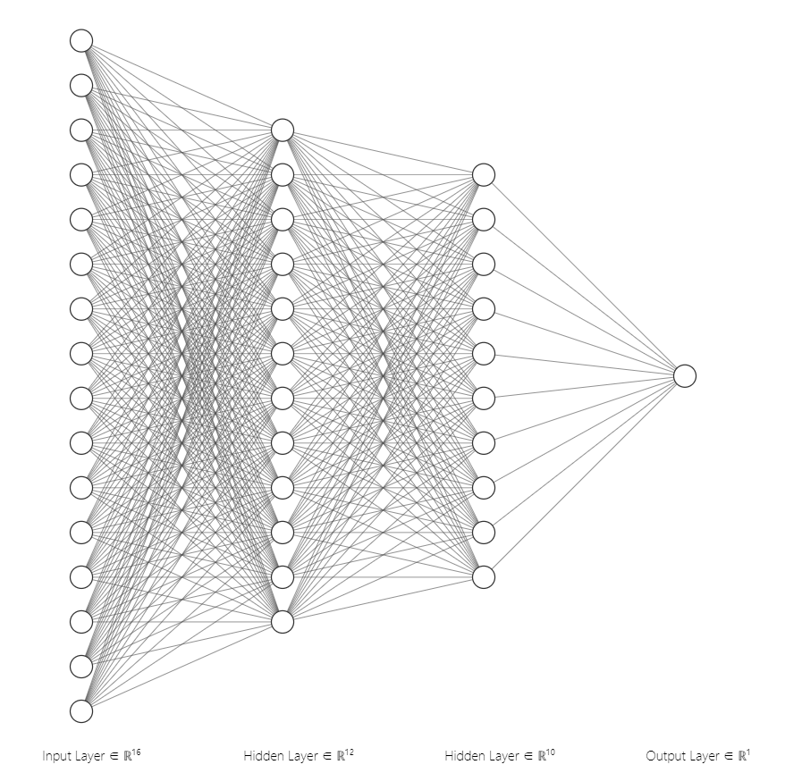
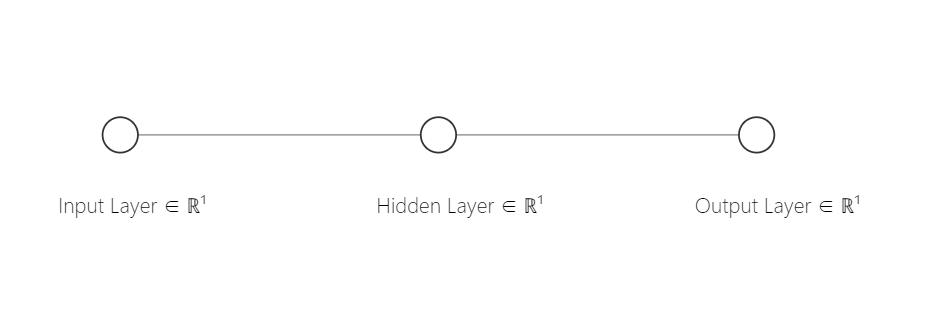
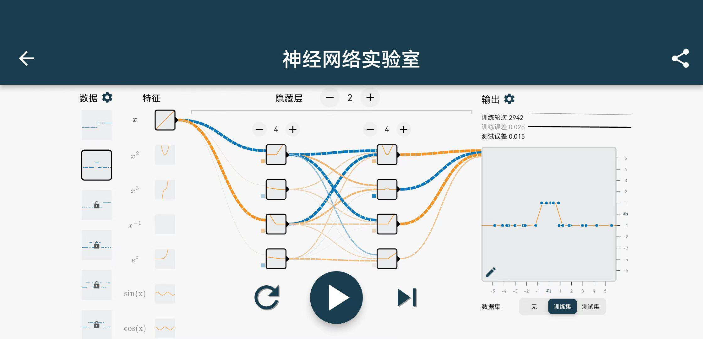

<h1 align="center">Novel AI</h1>

​	***NovelAI***是由**美国特拉华州**的Anlatan公司开发的云端软件即服务模式订阅制服务，其下有辅助故事写作以及文本到图像生成功能，于2021年6月15日推出测试版，2022年10月3日推出图像生成服务。

##  原理

NovelAI的图像生成模型是使用8个[NVIDIA A100](https://zh.m.wikipedia.org/wiki/安培微架构) GPU在基于[Danbooru](https://zh.m.wikipedia.org/zh-sg/NovelAI#cite_note-4)的约530万张图片的数据集上对原始码可用的[Stable Diffusion](https://zh.m.wikipedia.org/zh-sg/Stable_Diffusion)模型微调而来的，属于扩散模型。

[AUTOMATIC1111/stable-diffusion-webui](https://github.com/AUTOMATIC1111/stable-diffusion-webui#readme)

- [Stable Diffusion](https://github.com/CompVis/stable-diffusion)
- [Transformers](https://github.com/CompVis/taming-transformers)
- [k-diffusion](https://github.com/crowsonkb/k-diffusion.git)
- [GFPGAN](https://github.com/TencentARC/GFPGAN.git)
- [CodeFormer](https://github.com/sczhou/CodeFormer)
- [ESRGAN](https://github.com/xinntao/ESRGAN)
- [SwinIR](https://github.com/JingyunLiang/SwinIR)
- [Swin2SR](https://github.com/mv-lab/swin2sr)
- [LDSR](https://github.com/Hafiidz/latent-diffusion)
- [Ideas for optimizations](https://github.com/basujindal/stable-diffusion)
- Cross Attention layer optimization - [Doggettx](https://github.com/Doggettx/stable-diffusion), original idea for prompt editing.
- Cross Attention layer optimization - [InvokeAI, lstein](https://github.com/invoke-ai/InvokeAI)   ([originally](http://github.com/lstein/stable-diffusion))
- Textual Inversion - [Rinon Gal](https://github.com/rinongal/textual_inversion)  (we're not using his code, but we are using his ideas).
- [Idea for SD upscale](https://github.com/jquesnelle/txt2imghd)
- [Noise generation for outpainting mk2](https://github.com/parlance-zz/g-diffuser-bot)
- [CLIP interrogator idea and borrowing some code](https://github.com/pharmapsychotic/clip-interrogator)
- [Idea for Composable Diffusion](https://github.com/energy-based-model/Compositional-Visual-Generation-with-Composable-Diffusion-Models-PyTorch)
- [xformers](https://github.com/facebookresearch/xformers)
- [DeepDanbooru](https://github.com/KichangKim/DeepDanbooru) - interrogator for anime diffusers 

 
 

***

 
 

## 什么是神经网络？

- 一个最基础的神经网络

   
  
  

  $$
  w\ :\ Weight\\
  b\ :\ Bias\\
  对于任意节点u\\
  Output_u\ =\ Input_u\ *\ w_u\ +\ b_u\\
  \\ \\
  对于隐藏层中的节点:\\
  Input_u\ =\ \Sigma_{v->u}Output_v
  $$

- 训练集与测试集
  
      通常划分整体数据集的 10% ~ 20% 作为测试集

  

## 神经网络实验：万能函数拟合器

### 概述

​		都说神经网络是一个万能的函数拟合器，如何理解这句话呢？让我们做一些实验，去获取更直观的理解。 为了直观与方便理解，我们用神经网络去拟合一元函数，也就是 $y = f(x)$

### 实验

- 函数 $f(x) = kx+b$

如图所示：

- 蓝色点代表训练样本，它们都是从函数$f(x) = x$中取样获得
- 橙色的直线代表神经网络所表示的函数，目前未训练，与样本偏较大
- $Loss_{MSE} = \Sigma\ (Y_{data}-Y_{predict})^2$
  
### 训练
<iframe height=800 width=800 src="Linear.mp4">

 
 

*****

 
 

## 分类问题模型(Classification)

 
 

*****
*****

 
 

### 考虑一个运用神经网络的做法 如何生成一个图片 (1 x 10 x 10) ？
- 构建一个神经网络
- Input为1*10*10的随机噪声
- Output有 10*10 个节点，对应着图片中的每一个像素值
- 隐藏层未知 可以根据训练精度手动调整
- Loss函数怎么处理？如何修正参数 ？

 

# 生成对抗神经网络 (***Generative Adversarial Nets, GAN***)
- **判别模型**与**生成模型** 
    对抗生成模型GAN首先是一个生成模型，和大家比较熟悉的、用于分类的判别模型不同。

  > GAN模型中有两个核心的组成：生成器（Generator）与判别器（Discriminator）。参照图5，GAN的判别器与生成器都由多层感知机（可以看成全连接神经网络，即FC）构成。GAN模型的训练过程中，体现“对抗”的关键步骤是：
  > 1) 固定生成器（的参数），训练（优化）判别器，使得判别器能够尽可能准确地区分“真图像“与”假图像“；
  > 2) 在完成步骤1之后，固定判别器（的参数），训练（优化）生成器，尽可能使得判别器无法准确地区分“真图像“与”假图像“。

---
 

## 生成手写数字
 

  > ### iteration=1000
  >

 

  >### iteration=3000
  >
  
 

  > ### iteration=20000
  >

***

 
 

**GAN网络只能针对特定情况进行图片生成 比如人脸、手写数字...**

如果想要针对多种情况进行图片生成，使用GAN网络的代价将非常大

> 如果我们把限制条件作为参数直接传入模型呢？

 

# Stable Diffusion
Stable Diffusion 是基于 Latent Diffusion Models，专门用于文图生成任务的模型

## Stable Diffusion 模型
>

Stable Diffusion为了提高运算速度，使用了AutoEncoder自编码模型，可以将原图压缩至更低的维度，以减小运算量，最后由低维向量扩展至原尺寸

## 模型的关键操作 Diffusion (扩散)
  - 从有噪声的情况开始，逐渐改善图像，直到完全没有噪声，逐步接近所提供的限制条件。

## 扩散模型 (Diffusion Models, DM) 是如何学习的
  - 扩散模型（Diffusion Models, DM）是基于 Transformer 的生成模型，它采样一段数据（例如图像）并随着时间的推移逐渐增加噪声，直到数据无法被识别。该模型尝试将图像回退到原始形式，在此过程中学习如何生成图片或其他数据。

## 扩散模型的问题
  - 需要消耗巨大的GPU资源，整体运算的成本相当高。
  - 为了使 DM 在有限的计算资源上进行训练而不影响其质量以及灵活性，Stable Diffusion 将 DM 应用于强大的预训练自动编码器（Pre-trained Autoencoders）。

## 处理限制条件 —— Cross Attention 交叉注意力机制
  - 在模型结构中引入交叉注意力层（cross attention layer），使扩散模型成为一个强大而灵活的生成器
  - 将每一个限制条件通过特殊编码，叠加在每一个***交叉注意力层***，从而生成符合给定的限制条件的图片

 

# 效果展示

看一下在各个任务上的效果。

> 类别条件图片生成（unconditional-image ）：
> 

> 文图生成（text-to-image）：
> 
> 

> 布局图片生成（layout-to-image）：
> 

> 超分辨率（super-resolution）：
> 

> 图片修复（inpainting, object removal）：
> 

> 风景图语义合成（semantic-to-image，semantic synthesis of landscape images）：
> 

 
 

***

 
 

### 参考

  1) [论文] High-Resolution Image Synthesis with Latent Diffusion Model - https://arxiv.org/abs/2112.10752
  2) [论文] CAT: Cross Attention in Vision Transformer - https://arxiv.org/abs/2106.05786
  3) [论文] Autoencoders - https://arxiv.org/abs/2003.05991
  4) [论文] Diffusion Models: A Comprehensive Survey of Methods and Applications - https://arxiv.org/abs/2209.00796
  5) [论文] Attention Is All You Need - https://arxiv.org/abs/1706.03762
  6) [Wikipedia] NovelAI - https://zh.m.wikipedia.org/zh-cn/NovelAI
  7) Stable Diffusion原理解读 - https://zhuanlan.zhihu.com/p/583124756
  8) 【全】一文带你了解自编码器（AutoEncoder） - https://zhuanlan.zhihu.com/p/80377698
  9) 理解 DALL·E 2， Stable Diffusion 和 Midjourney 的工作原理 - https://xie.infoq.cn/article/2c3b18864176bed4fbc0d576c
  10) 对抗生成网络（GAN）为什么输入随机噪声？ - https://www.zhihu.com/question/320465400# Notes-about-Novel-AI
